# Tutorial Django krok po kroku: prosty System zgłoszeń

> **Uwaga:** w przykładach używana jest komenda `python`. Jeżeli w danym systemie interpreter działa jako `python3` albo `py`, należy konsekwentnie używać tej wersji w całym tutorialu.
>
> **Efekt końcowy:** prosta aplikacja Django typu CRUD z podstawową obsługą `Django Admin`.

## Spis treści

1. [Wprowadzenie](#wprowadzenie)
2. [Plan działania](#plan-dzialania)
3. [Wymagania wstępne](#wymagania-wstepne)
4. [Tworzenie projektu Django](#tworzenie-projektu-django)
5. [Tworzenie aplikacji](#tworzenie-aplikacji)
6. [Rejestracja aplikacji w `settings.py`](#rejestracja-aplikacji-w-settingspy)
7. [Model zgłoszenia](#model-zgloszenia)
8. [Migracje](#migracje)
9. [Panel administratora Django](#panel-administratora-django)
10. [Formularze](#formularze)
11. [Widoki](#widoki)
12. [Adresy URL](#adresy-url)
13. [Szablony HTML](#szablony-html)
14. [Bootstrap](#bootstrap)
15. [CRUD](#crud)
16. [Podsumowanie](#podsumowanie)

<a id="wprowadzenie"></a>

## 1. Wprowadzenie

Django to framework webowy dla języka Python. Dostarcza gotowe narzędzia do budowania aplikacji internetowych, dzięki czemu można skupić się na logice programu zamiast pisać wszystko od zera.

W tym tutorialu powstanie prosta aplikacja **System zgłoszeń**, w której użytkownik będzie mógł:

1. dodać zgłoszenie,
2. zobaczyć listę zgłoszeń,
3. edytować zgłoszenie,
4. usunąć zgłoszenie.

Zakres materiału obejmuje podstawowe elementy pracy w Django:

1. tworzenie projektu i aplikacji,
2. definiowanie modelu,
3. wykonywanie migracji,
4. korzystanie z `Django Admin`,
5. tworzenie formularza,
6. pisanie widoków,
7. konfigurację adresów URL,
8. tworzenie szablonów HTML,
9. realizację pełnego CRUD.

Szacowany czas wykonania: około 2 godzin.

### Krótki słownik pojęć

| Pojęcie              | Znaczenie                                                       |
| -------------------- | --------------------------------------------------------------- |
| **Projekt Django**   | główny kontener aplikacji i jej konfiguracji                    |
| **Aplikacja Django** | moduł odpowiedzialny za konkretną funkcję, np. obsługę zgłoszeń |
| **Model**            | opis danych przechowywanych w bazie                             |
| **Migracja**         | instrukcja aktualizująca strukturę bazy danych                  |
| **Widok**            | kod Pythona obsługujący żądanie HTTP                            |
| **URL**              | adres prowadzący do konkretnej funkcji aplikacji                |
| **Formularz**        | warstwa odpowiedzialna za przyjmowanie i walidację danych       |
| **Szablon**          | plik HTML wypełniany danymi przez Django                        |

<a id="plan-dzialania"></a>

## 2. Plan działania

Tutorial prowadzi od najprostszych elementów do gotowej aplikacji. Kolejność pracy będzie następująca:

1. przygotowanie środowiska,
2. utworzenie projektu Django,
3. utworzenie aplikacji `zgloszenia`,
4. rejestracja aplikacji w konfiguracji,
5. zdefiniowanie modelu `Zgloszenie`,
6. wykonanie migracji,
7. rejestracja modelu w panelu administratora,
8. przygotowanie formularza,
9. dodanie widoków,
10. skonfigurowanie URL-i,
11. stworzenie prostych szablonów HTML,
12. poprawienie wyglądu za pomocą Bootstrapa,
13. sprawdzenie pełnego CRUD,
14. test końcowy aplikacji,

<a id="wymagania-wstepne"></a>

## 3. Wymagania wstępne

### Cel kroku

Przygotować środowisko lokalne potrzebne do pracy z Django.

### Co należy zrobić

1. Utworzyć katalog projektu i przejść do niego.
2. Sprawdzić dostępność interpretera Python i narzędzia `pip`.
3. Utworzyć środowisko wirtualne.
4. Aktywować środowisko wirtualne.
5. Zainstalować Django.

### Kod / polecenia

1. Utworzenie katalogu roboczego:

    #### Windows PowerShell

    ```powershell
    mkdir system_zgloszen
    cd system_zgloszen
    ```

    #### macOS / Linux

    ```bash
    mkdir system_zgloszen
    cd system_zgloszen
    ```

2. Sprawdzenie Pythona i `pip`:

    #### Windows PowerShell

    ```powershell
    py --version
    pip --version
    ```

    #### macOS / Linux

    ```bash
    python3 --version
    pip --version
    ```

3. Utworzenie środowiska wirtualnego:

    #### Windows PowerShell

    ```powershell
    py -m venv venv
    ```

    #### macOS / Linux

    ```bash
    python3 -m venv venv
    ```

4. Aktywacja środowiska:

    #### Windows PowerShell

    ```powershell
    venv\Scripts\Activate
    ```

    #### macOS / Linux

    ```bash
    source venv/bin/activate
    ```

5. Instalacja Django:

    ```bash
    pip install django
    django --version
    ```

### Wyjaśnienie

Środowisko wirtualne izoluje pakiety instalowane dla konkretnego projektu. Dzięki temu:

1. zależności tego projektu nie mieszają się z innymi,
2. łatwiej utrzymać porządek,
3. zmniejsza się ryzyko konfliktów wersji bibliotek.

Po aktywacji środowiska w terminalu zwykle pojawia się prefiks podobny do:

```text
(venv)
```

To znak, że kolejne polecenia będą wykonywane w kontekście lokalnego środowiska projektu.

### Sprawdzenie

Jeżeli polecenie `python -m django --version` zwraca numer wersji, środowisko jest gotowe do dalszej pracy.

> Wynik poleceń `python --version`, `pip --version` i `python -m django --version`:
>
> 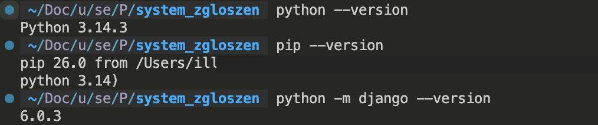

### Efekt

Aktywne środowisko wirtualne i zainstalowane Django gotowe do użycia w kolejnych krokach.

### Typowe problemy

1. `python`, `python3` albo `py` nie jest rozpoznawane.
2. `pip` nie działa i trzeba użyć `python -m pip`.
3. Środowisko wirtualne nie aktywuje się, bo polecenie wykonano w złym katalogu.

<a id="tworzenie-projektu-django"></a>

## 4. Tworzenie projektu Django

### Cel kroku

Utworzyć główną strukturę projektu Django.

### Co należy zrobić

1. Upewnić się, że środowisko wirtualne jest aktywne.
2. W katalogu `system_zgloszen` wykonać polecenie tworzące projekt.
3. Uruchomić serwer developerski.
4. Sprawdzić, czy domyślna strona Django działa.

### Kod / polecenia

```bash
django-admin startproject config .
python manage.py runserver
```

Po utworzeniu projektu struktura katalogów powinna wyglądać podobnie do tej:

```text
system_zgloszen/
├── manage.py
├── db.sqlite3
├── config/
│   ├── __init__.py
│   ├── asgi.py
│   ├── settings.py
│   ├── urls.py
│   └── wsgi.py
└── venv/
    └── ...
```

Aplikacja będzie dostępna pod adresem:

```text
http://127.0.0.1:8000/
```

### Wyjaśnienie

Polecenie `startproject` tworzy podstawowy szkielet projektu Django.

W zapisie:

```bash
django-admin startproject config .
```

1. `config` to nazwa modułu konfiguracyjnego projektu,
2. `.` oznacza utworzenie projektu w bieżącym katalogu.

Gdyby pominąć kropkę, Django utworzyłoby dodatkowy podfolder.

Najważniejsze pliki projektu:

| Plik                               | Rola                                    |
| ---------------------------------- | --------------------------------------- |
| `manage.py`                        | uruchamianie poleceń Django             |
| `config/settings.py`               | konfiguracja projektu                   |
| `config/urls.py`                   | główna mapa URL-i                       |
| `config/asgi.py`, `config/wsgi.py` | pliki pomocnicze uruchamiania aplikacji |

### Sprawdzenie

Po wejściu na `http://127.0.0.1:8000/` powinna pojawić się domyślna strona startowa Django.

> Rezultat uruchomienia `python manage.py runserver`:
>
> 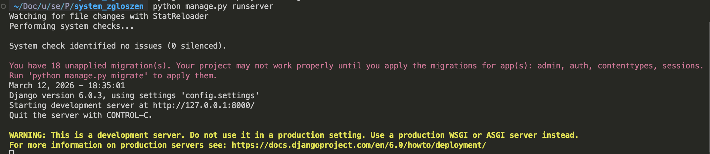
>
> Ekran startowy Django po utworzeniu projektu.
>
> 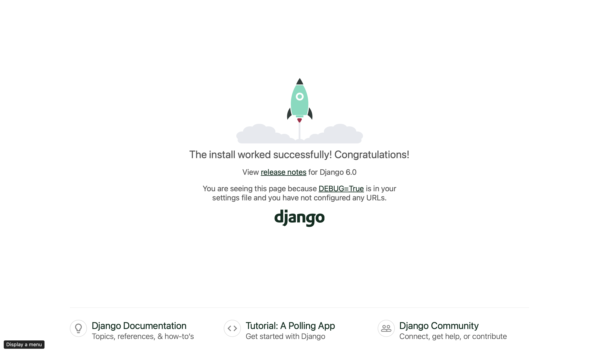

### Efekt

Projekt Django został utworzony i uruchamia się poprawnie.

### Typowe problemy

1. Projekt został utworzony w dodatkowym podfolderze, bo pominięto kropkę `.`.
2. Serwer nie startuje, bo środowisko wirtualne nie jest aktywne.

<a id="tworzenie-aplikacji"></a>

## 5. Tworzenie aplikacji

### Cel kroku

Utworzyć aplikację Django odpowiedzialną za obsługę zgłoszeń.

### Co należy zrobić

1. W katalogu z plikiem `manage.py` wykonać polecenie `startapp`.
2. Sprawdzić, jakie pliki Django utworzyło automatycznie.

### Kod / polecenia

```bash
python manage.py startapp zgloszenia
```

Po wykonaniu polecenia powstanie katalog:

```text
zgloszenia/
├── __init__.py
├── admin.py
├── apps.py
├── migrations/
│   └── __init__.py
├── models.py
├── tests.py
└── views.py
```

### Wyjaśnienie

W Django trzeba odróżniać:

1. **projekt** jako całość aplikacji internetowej,
2. **aplikację** jako moduł realizujący konkretną funkcję.

W tym tutorialu:

1. projekt przechowuje konfigurację całego systemu,
2. aplikacja `zgloszenia` przechowuje logikę dotyczącą zgłoszeń.

Najważniejsze pliki aplikacji:

| Plik          | Rola                                       |
| ------------- | ------------------------------------------ |
| `models.py`   | definicje danych w bazie                   |
| `views.py`    | logika odpowiadająca za odpowiedzi HTTP    |
| `admin.py`    | rejestracja modeli w panelu administratora |
| `migrations/` | opis zmian w strukturze bazy danych        |

### Sprawdzenie

Jeżeli w projekcie pojawił się katalog `zgloszenia`, aplikacja została utworzona poprawnie.

### Efekt

Istnieje osobna aplikacja Django, w której będzie rozwijana funkcjonalność systemu zgłoszeń.

### Typowe problemy

1. Polecenie wykonano poza katalogiem z `manage.py`.
2. Nazwa aplikacji została wpisana z literówką.

<a id="rejestracja-aplikacji-w-settingspy"></a>

## 6. Rejestracja aplikacji w `settings.py`

### Cel kroku

Dodać aplikację `zgloszenia` do konfiguracji projektu.

### Co należy zrobić

1. Otworzyć plik `config/settings.py`.
2. Odszukać listę `INSTALLED_APPS`.
3. Dopisać wpis `"zgloszenia"`.

### Kod / polecenia

W pliku `config/settings.py` lista powinna wyglądać następująco:

```python
INSTALLED_APPS = [
    "django.contrib.admin",
    "django.contrib.auth",
    "django.contrib.contenttypes",
    "django.contrib.sessions",
    "django.contrib.messages",
    "django.contrib.staticfiles",
    "zgloszenia",
]
```

### Wyjaśnienie

`INSTALLED_APPS` to lista aplikacji ładowanych przy starcie projektu. Jeżeli nie dodamy `"zgloszenia"`, Django nie będzie wiedziało, że ma obsługiwać modele, widoki i szablony z tej aplikacji.

Bez tego kroku:

1. migracje nie będą obejmowały modelu z aplikacji,
2. panel administratora nie pokaże modelu,
3. część mechanizmów Django nie zadziała zgodnie z oczekiwaniami.

### Efekt

Django zna już aplikację `zgloszenia` i będzie ją uwzględniało w dalszej pracy.

### Typowe problemy

1. Brak przecinka przy poprzednim elemencie listy.
2. Literówka w nazwie `"zgloszenia"`.

<a id="model-zgloszenia"></a>

## 7. Model zgłoszenia

W tej sekcji zdefiniujemy strukturę pojedynczego zgłoszenia w kilku małych krokach. Najpierw dodamy pola opisujące dane użytkownika i treść zgłoszenia, a dopiero później uzupełnimy model o datę utworzenia oraz czytelną reprezentację tekstową.

### Krok 7.1 Dodanie klasy modelu i podstawowych pól

#### Cel kroku

Utworzyć model `Zgloszenie` i dodać pola, które użytkownik będzie uzupełniał ręcznie.

#### Co należy dodać / zmienić

W pliku `zgloszenia/models.py` dodaj:

```python
from django.db import models


class Zgloszenie(models.Model):
    imie_nazwisko = models.CharField(max_length=100, verbose_name="Imię i nazwisko")
    email = models.EmailField(verbose_name="Adres e-mail")
    temat = models.CharField(max_length=150, verbose_name="Temat zgłoszenia")
    tresc = models.TextField(verbose_name="Treść zgłoszenia")
```

#### Wyjaśnienie

Ten fragment tworzy model danych oraz cztery pola, które użytkownik będzie wpisywał w formularzu:

1. `imie_nazwisko` przechowuje imię i nazwisko,
2. `email` pilnuje formatu adresu e-mail,
3. `temat` przechowuje krótki tytuł zgłoszenia,
4. `tresc` przechowuje dłuższy opis problemu.

Przewodnik po polach Django:

1. `CharField(max_length=...)` - To pole służy do przechowywania krótkich ciągów znaków (tytuły, nazwy, imiona).
   - Zawsze wymaga parametru `max_length`, który określa limit znaków w bazie danych.
2. `TextField()` - Idealne dla opisów zadań, treści ogłoszeń lub komentarzy.
   - W przeciwieństwie do CharField, nie ma limitu znaków (zależy od bazy) i w panelu admina wyświetla się jako duże pole tekstowe (textarea).
3. `EmailField` - To pole służy do przechowywania email.
4. Więcej można zobaczyć tu: [dokumentacja Django](https://docs.djangoproject.com/en/stable/ref/models/fields/#field-types)

Na tym etapie model opisuje najważniejsze dane biznesowe i niczego jeszcze nie zapisuje do bazy. To nastąpi dopiero po wykonaniu migracji w dalszej części tutoriala.

#### Efekt

Model ma już pola, które będą później widoczne w formularzu.

### Krok 7.2 Dodanie daty utworzenia i czytelnego opisu obiektu

#### Cel kroku

Uzupełnić model o dane techniczne oraz o wygodne wyświetlanie obiektu w panelu admina.

#### Co należy dodać / zmienić

Do klasy `Zgloszenie` dopisz:

```python
    data_utworzenia = models.DateTimeField(auto_now_add=True, verbose_name="Data utworzenia")

    class Meta:
        verbose_name = "Zgłoszenie"
        verbose_name_plural = "Zgłoszenia"

    def __str__(self):
        return f"{self.temat} - {self.imie_nazwisko}"
```

#### Wyjaśnienie

Ten fragment rozbudowuje model o trzy ważne elementy:

1. `data_utworzenia` zapisuje datę i godzinę utworzenia rekordu automatycznie,
2. `class Meta` ustawia czytelne nazwy modelu w panelu administratora,
3. `__str__` mówi Django, jaki tekst pokazywać przy obiekcie, np. na listach w panelu admina.

To dobry moment, żeby zauważyć różnicę między polami wpisywanymi przez użytkownika a polami generowanymi automatycznie przez aplikację.

#### Efekt

Model jest kompletny i gotowy do przeniesienia do bazy danych.

### Pełny kod pliku `zgloszenia/models.py`

```python
from django.db import models


class Zgloszenie(models.Model):
    imie_nazwisko = models.CharField(max_length=100, verbose_name="Imię i nazwisko")
    email = models.EmailField(verbose_name="Adres e-mail")
    temat = models.CharField(max_length=150, verbose_name="Temat zgłoszenia")
    tresc = models.TextField(verbose_name="Treść zgłoszenia")
    data_utworzenia = models.DateTimeField(auto_now_add=True, verbose_name="Data utworzenia")

    class Meta:
        verbose_name = "Zgłoszenie"
        verbose_name_plural = "Zgłoszenia"

    def __str__(self):
        return f"{self.temat} - {self.imie_nazwisko}"
```

<a id="migracje"></a>

## 8. Migracje

### Cel kroku

Przenieść definicję modelu do struktury bazy danych.

### Co należy zrobić

1. Wygenerować plik migracji.
2. Wykonać migracje na bazie danych.
3. Opcjonalnie sprawdzić listę migracji.

### Kod / polecenia

```bash
python manage.py makemigrations
python manage.py migrate
```

### Wyjaśnienie

Migracje są mechanizmem synchronizacji modeli Django z bazą danych.

Różnica między poleceniami:

1. `makemigrations` tworzy plik opisujący zmiany,
2. `migrate` wykonuje te zmiany na bazie danych,
3. `showmigrations` pokazuje, które migracje zostały już zastosowane.

Domyślnie projekt korzysta z lokalnej bazy SQLite zapisanej w pliku `db.sqlite3`.

### Sprawdzenie

Po wykonaniu poleceń w katalogu `zgloszenia/migrations/` powinien pojawić się plik podobny do `0001_initial.py`.

> Rezultat `python manage.py makemigrations` i `python manage.py migrate`:
>
> 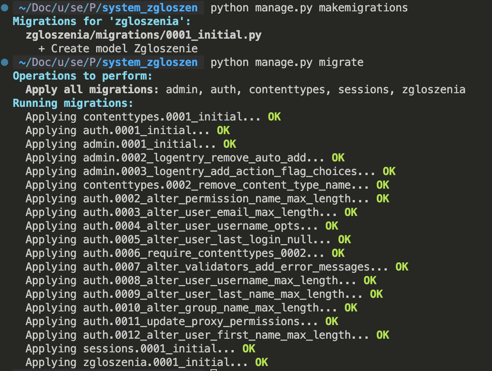

### Efekt

Baza danych zna już tabelę odpowiadającą modelowi `Zgloszenie`.

### Typowe problemy

1. Model nie został wykryty, bo aplikacja nie jest w `INSTALLED_APPS`.
2. Wykonano tylko `makemigrations` bez `migrate`.
3. Polecenia uruchomiono poza katalogiem z `manage.py`.

<a id="panel-administratora-django"></a>

## 9. Panel administratora Django

W tej sekcji najpierw zarejestrujemy model w `admin.py`, a potem utworzymy konto administratora i sprawdzimy panel w przeglądarce.

### Krok 9.1 Rejestracja modelu w panelu admina

#### Cel kroku

Sprawić, aby model `Zgloszenie` był widoczny w `Django Admin`.

#### Co należy dodać / zmienić

W pliku `zgloszenia/admin.py` wpisz:

```python
from django.contrib import admin

from .models import Zgloszenie


admin.site.register(Zgloszenie)
```

#### Wyjaśnienie

Samo istnienie modelu nie powoduje jeszcze, że pojawi się on w panelu administratora. Rejestracja mówi Django: ten model ma być dostępny w interfejsie administracyjnym.

#### Efekt

Panel admina będzie mógł wyświetlać i edytować zgłoszenia.

### Krok 9.2 Utworzenie konta administratora

#### Cel kroku

Przygotować użytkownika, który będzie mógł zalogować się do panelu `/admin/`.

#### Co należy dodać / zmienić

W terminalu wykonaj:

```bash
python manage.py createsuperuser
```

#### Wyjaśnienie

Polecenie uruchamia kreator tworzenia konta administratora. Django poprosi o:

1. nazwę użytkownika,
2. adres e-mail (może być dowolny),
3. hasło.

> 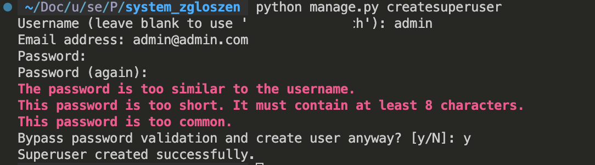

#### Sprawdzenie

Jeżeli polecenie zakończy się komunikatem o poprawnym utworzeniu użytkownika, konto administratora jest gotowe.

#### Efekt

Można przejść do logowania w panelu admina.

### Krok 9.3 Uruchomienie panelu administratora

#### Cel kroku

Sprawdzić, czy model i konto administratora działają razem poprawnie.

#### Co należy dodać / zmienić

Uruchom serwer developerski:

```bash
python manage.py runserver
```

Następnie wejdź na adres:

```text
http://127.0.0.1:8000/admin/
```

> 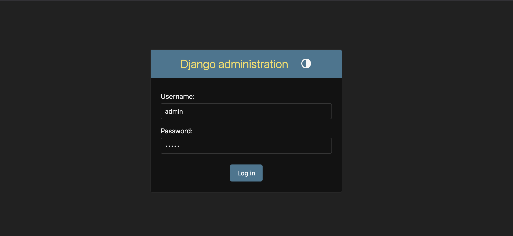

#### Wyjaśnienie

Django automatycznie generuje profesjonalny panel administracyjny na podstawie Twoich modeli.

- Możesz tu dodawać, edytować i usuwać zgłoszenia bez pisania ani jednej linii kodu HTML.
- Po zalogowaniu panel powinien pokazać sekcję z modelem `Zgłoszenia`. Na razie lista rekordów będzie prawdopodobnie pusta, bo nie dodaliśmy jeszcze danych przez formularz.

#### Sprawdzenie

Jeżeli możesz się zalogować i widzisz model `Zgłoszenia`, konfiguracja panelu admina jest poprawna.

> Panel administratora po zalogowaniu:
>
> 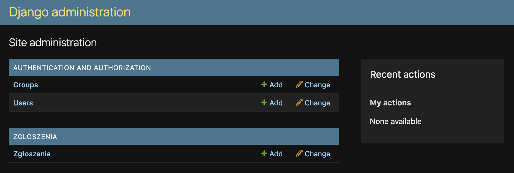

#### Efekt

Projekt ma działający panel administracyjny z dostępem do modelu `Zgloszenie`.

<a id="formularze"></a>

## 10. Formularze

W tej sekcji zbudujemy formularz etapami. Najpierw powstanie plik i importy, potem dodamy samą klasę formularza, a na końcu określimy wszystkie pola, które użytkownik ma wypełniać.

### Krok 10.1 Utworzenie pliku `forms.py` i importów

#### Cel kroku

Przygotować miejsce na formularz powiązany z modelem `Zgloszenie`.

#### Co należy dodać / zmienić

Utwórz plik `zgloszenia/forms.py` i dodaj:

```python
from django import forms

from .models import Zgloszenie
```

#### Wyjaśnienie

1. `forms` będzie potrzebne do tworzenia formularza,
2. `Zgloszenie` jest potrzebne, ponieważ formularz ma korzystać z danych modelu.

Na tym etapie formularz jeszcze nie istnieje, ale plik jest już przygotowany pod dalszą rozbudowę.

#### Efekt

W projekcie istnieje plik `forms.py`, gotowy do dodania formularza.

### Krok 10.2 Dodanie klasy `ZgloszenieForm`

#### Cel kroku

Utworzyć formularz typu `ModelForm`, aby Django samo zbudowało pola na podstawie modelu.

#### Co należy dodać / zmienić

Do pliku `zgloszenia/forms.py` dopisz:

```python
class ZgloszenieForm(forms.ModelForm):
    class Meta:
      model = Zgloszenie
      fields = ["imie_nazwisko", "email", "temat", "tresc"]
```

#### Wyjaśnienie

`ModelForm` to formularz generowany na podstawie modelu i obejmuje wszystkie pola wypełniane ręcznie przez użytkownika. Nie dodajemy `data_utworzenia`, bo to pole ma być uzupełniane automatycznie przez Django.

#### Efekt

Formularz jest gotowy logicznie. W kolejnych sekcjach podłączymy go do widoków i szablonów, a później poprawimy jego wygląd za pomocą Bootstrapa.

### Pełny kod pliku `zgloszenia/forms.py`

```python
from django import forms

from .models import Zgloszenie


class ZgloszenieForm(forms.ModelForm):
    class Meta:
      model = Zgloszenie
      fields = ["imie_nazwisko", "email", "temat", "tresc"]
```

<a id="widoki"></a>

## 11. Widoki

W tej sekcji nie będziemy od razu wklejać całego `views.py`. Najpierw przygotujemy importy, potem osobno dodamy widok listy, dodawania, edycji i usuwania. Dzięki temu każda funkcja będzie miała jasny cel.

### Krok 11.1 Importy potrzebne w `views.py`

#### Cel kroku

Przygotować plik `zgloszenia/views.py` do obsługi danych i szablonów.

#### Co należy dodać / zmienić

W pliku `zgloszenia/views.py` ustaw:

```python
from django.shortcuts import get_object_or_404, redirect, render

from .forms import ZgloszenieForm
from .models import Zgloszenie
```

#### Wyjaśnienie

Każdy z importów ma konkretne zadanie:

1. `render()` łączy dane z szablonem HTML,
2. `redirect()` przenosi użytkownika na inny adres po wykonaniu akcji,
3. `get_object_or_404()` pobiera rekord albo zwraca błąd 404,
4. `ZgloszenieForm` będzie używany przy dodawaniu i edycji,
5. `Zgloszenie` będzie używany do pobierania danych z bazy.

### Krok 11.2 Dodanie widoku listy zgłoszeń

#### Cel kroku

Przygotować widok, który pobierze wszystkie rekordy i przekaże je do szablonu listy.

#### Co należy dodać / zmienić

Do `zgloszenia/views.py` dopisz:

```python
def lista_zgloszen(request):
    # Pobieramy wszystkie rekordy z tabeli Zgloszenie za pomocą Managera (objects).
    # Funkcja order_by("-data_utworzenia") sortuje je malejąco (znak minus) — najnowsze na górze.
    zgloszenia = Zgloszenie.objects.all().order_by("-data_utworzenia")
    # Funkcja render składa końcową stronę HTML.
    # Przekazujemy: żądanie (request), ścieżkę do pliku HTML oraz słownik z danymi (context).
    return render(
      request,
      "zgloszenia/lista_zgloszen.html",
      {"zgloszenia": zgloszenia},
    )
```

#### Wyjaśnienie

Ten widok:

1. pobiera wszystkie zgłoszenia z bazy,
2. sortuje je od najnowszego do najstarszego,
3. przekazuje dane do szablonu `lista_zgloszen.html`, który stworzymy później.

To pierwszy widok, który będzie wyświetlany jako strona główna naszej aplikacji.

#### Efekt

Logika wyświetlania listy zgłoszeń jest gotowa. Zobaczymy ją w przeglądarce po podłączeniu URL-i i szablonu.

### Krok 11.3 Dodanie widoku tworzenia zgłoszenia

#### Cel kroku

Przygotować widok obsługujący wyświetlenie formularza oraz zapis nowego rekordu.

#### Co należy dodać / zmienić

Do `zgloszenia/views.py` dopisz:

```python
def dodaj_zgloszenie(request):
    # Sprawdzamy, czy użytkownik przesłał dane formularzem (metoda POST)
    if request.method == "POST":
      # Wypełniamy formularz danymi z żądania
      form = ZgloszenieForm(request.POST)
      # Walidacja: czy pola są poprawne i spełniają limity (np. max_length)
      if form.is_valid():
          # Zapisujemy nowy rekord do bazy danych
          form.save()
          # Przekierowujemy użytkownika na listę zgłoszeń (powrót na główną)
          return redirect("zgloszenia:lista_zgloszen")
    else:
      # Jeśli to pierwsze wejście na stronę (metoda GET), tworzymy pusty formularz
      form = ZgloszenieForm()

    # Funkcja render składa końcową stronę HTML.
    # Przekazujemy: żądanie (request), ścieżkę do pliku HTML oraz słownik z danymi (context).
    return render(
      request,
      "zgloszenia/formularz_zgloszenia.html",
      {
          "form": form,
          "tytul": "Dodaj zgłoszenie",
          "tekst_przycisku": "Zapisz zgłoszenie",
      },
    )
```

#### Wyjaśnienie

W tym widoku pojawia się typowy schemat pracy z formularzem Django:

1. przy `GET` tworzymy pusty formularz,
2. przy `POST` formularz dostaje dane z przeglądarki,
3. `form.is_valid()` sprawdza poprawność danych,
4. `form.save()` zapisuje rekord do bazy,
5. po zapisie następuje `redirect()` na listę zgłoszeń.

To pierwszy element operacji **Create**.

#### Efekt

Aplikacja potrafi już logicznie przyjąć nowe zgłoszenie.

### Krok 11.4 Dodanie widoku edycji zgłoszenia

#### Cel kroku

Przygotować widok, który odczyta istniejące zgłoszenie i pozwoli zmienić jego dane.

#### Co należy dodać / zmienić

Do `zgloszenia/views.py` dopisz:

```python
def edytuj_zgloszenie(request, pk):
    # Pobieramy konkretne zgłoszenie na podstawie jego klucza głównego (pk).
    # Jeśli nie istnieje, funkcja automatycznie zwróci stronę błędu 404.
    zgloszenie = get_object_or_404(Zgloszenie, pk=pk)

    if request.method == "POST":
      # Łączymy dane przesłane w formularzu (request.POST) z istniejącym obiektem (instance).
      # Dzięki temu Django wie, że ma zaktualizować ten konkretny rekord, a nie tworzyć nowy.
      form = ZgloszenieForm(request.POST, instance=zgloszenie)
      if form.is_valid():
          form.save()
          return redirect("zgloszenia:lista_zgloszen")
    else:
      # Przy wejściu metodą GET, wypełniamy formularz aktualnymi danymi zgłoszenia.
      form = ZgloszenieForm(instance=zgloszenie)

    return render(
      request,
      "zgloszenia/formularz_zgloszenia.html",
      {
          "form": form,
          "tytul": "Edytuj zgłoszenie",
          "tekst_przycisku": "Zapisz zmiany",
      },
    )
```

#### Wyjaśnienie

Najważniejszy element tego kroku to:

```python
instance=zgloszenie
```

To właśnie ten argument mówi Django, że formularz ma pracować na istniejącym rekordzie, a nie tworzyć nowy. Bez niego edycja mogłaby kończyć się dodaniem duplikatu.

#### Efekt

Aplikacja potrafi już aktualizować istniejące zgłoszenia.

### Krok 11.5 Dodanie widoku usuwania zgłoszenia

#### Cel kroku

Przygotować widok, który pokaże ekran potwierdzenia i usunie wskazany rekord dopiero po zatwierdzeniu.

#### Co należy dodać / zmienić

Do `zgloszenia/views.py` dopisz:

```python
def usun_zgloszenie(request, pk):
    # Pobieramy konkretne zgłoszenie do usunięcia na podstawie ID (pk).
    # Jeśli zgłoszenie nie istnieje, użytkownik zobaczy błąd 404.
    zgloszenie = get_object_or_404(Zgloszenie, pk=pk)

    # Bezpieczeństwo: sprawdzamy, czy użytkownik potwierdził chęć usunięcia (metoda POST).
    if request.method == "POST":
        # Usuwamy obiekt z bazy danych.
        zgloszenie.delete()
        # Po usunięciu wracamy na listę wszystkich zgłoszeń.
        return redirect("zgloszenia:lista_zgloszen")

    # Jeśli użytkownik wszedł metodą GET (np. kliknął w link "Usuń"),
    # wyświetlamy stronę z pytaniem "Czy na pewno?".
    return render(
        request,
        "zgloszenia/potwierdz_usuniecie.html",
        {"zgloszenie": zgloszenie},
    )
```

#### Wyjaśnienie

Usuwanie celowo nie dzieje się od razu po wejściu na adres. Najpierw użytkownik widzi ekran potwierdzenia, a dopiero wysłanie formularza metodą `POST` wykonuje `delete()`.

To ważny nawyk: operacje zmieniające dane powinny być wykonywane świadomie, a nie przypadkiem po samym kliknięciu linku.

#### Efekt

Logika wszystkich czterech operacji CRUD jest gotowa po stronie Pythona.

### Pełny kod pliku `zgloszenia/views.py`

```python
from django.shortcuts import get_object_or_404, redirect, render

from .forms import ZgloszenieForm
from .models import Zgloszenie


def lista_zgloszen(request):
    zgloszenia = Zgloszenie.objects.all().order_by("-data_utworzenia")
    return render(
        request,
        "zgloszenia/lista_zgloszen.html",
        {"zgloszenia": zgloszenia},
    )


def dodaj_zgloszenie(request):
    if request.method == "POST":
        form = ZgloszenieForm(request.POST)
        if form.is_valid():
            form.save()
            return redirect("zgloszenia:lista_zgloszen")
    else:
        form = ZgloszenieForm()

    return render(
        request,
        "zgloszenia/formularz_zgloszenia.html",
        {
            "form": form,
            "tytul": "Dodaj zgłoszenie",
            "tekst_przycisku": "Zapisz zgłoszenie",
        },
    )


def edytuj_zgloszenie(request, pk):
    zgloszenie = get_object_or_404(Zgloszenie, pk=pk)

    if request.method == "POST":
        form = ZgloszenieForm(request.POST, instance=zgloszenie)
        if form.is_valid():
            form.save()
            return redirect("zgloszenia:lista_zgloszen")
    else:
        form = ZgloszenieForm(instance=zgloszenie)

    return render(
        request,
        "zgloszenia/formularz_zgloszenia.html",
        {
            "form": form,
            "tytul": "Edytuj zgłoszenie",
            "tekst_przycisku": "Zapisz zmiany",
        },
    )


def usun_zgloszenie(request, pk):
    zgloszenie = get_object_or_404(Zgloszenie, pk=pk)

    if request.method == "POST":
        zgloszenie.delete()
        return redirect("zgloszenia:lista_zgloszen")

    return render(
        request,
        "zgloszenia/potwierdz_usuniecie.html",
        {"zgloszenie": zgloszenie},
    )
```

<a id="adresy-url"></a>

## 12. Adresy URL

W tej sekcji połączymy widoki z adresami URL. Zaczniemy od najprostszego adresu prowadzącego do listy, a potem krok po kroku dołożymy adresy dla dodawania, edycji i usuwania.

### Krok 12.1 Utworzenie pliku `zgloszenia/urls.py`

#### Cel kroku

Przygotować osobny plik na adresy URL aplikacji `zgloszenia`.

#### Co należy dodać / zmienić

Utwórz plik `zgloszenia/urls.py` i dodaj:

```python
from django.urls import path

from . import views

app_name = "zgloszenia"

urlpatterns = []
```

#### Wyjaśnienie

1. `path` służy do definiowania adresów URL,
2. `views` będzie potrzebne do połączenia adresu z konkretną funkcją,
3. `app_name` tworzy przestrzeń nazw, dzięki której później można używać nazw w stylu `zgloszenia:lista_zgloszen`.
4. `urlpatterns` urlpatterns to lista, która mapuje konkretne adresy URL wpisywane w przeglądarce na odpowiednie funkcje widoków

### Krok 12.2 Dodanie adresu URL dla listy zgłoszeń

#### Cel kroku

Połączyć stronę główną aplikacji z widokiem `lista_zgloszen`.

#### Co należy dodać / zmienić

Zmień `urlpatterns` w `zgloszenia/urls.py` na:

```python
urlpatterns = [
    path("", views.lista_zgloszen, name="lista_zgloszen"),
]
```

#### Wyjaśnienie

Ten wpis oznacza:

1. pusty adres `""` jest stroną główną aplikacji,
2. żądanie trafi do funkcji `lista_zgloszen`,
3. nazwa `lista_zgloszen` będzie używana w `redirect()` i w szablonach.

### Krok 12.3 Dodanie adresu URL dla tworzenia zgłoszenia

#### Cel kroku

Podłączyć widok odpowiedzialny za dodawanie nowych danych.

#### Co należy dodać / zmienić

Do `urlpatterns` dopisz:

```python
    path("dodaj/", views.dodaj_zgloszenie, name="dodaj_zgloszenie"),
```

#### Wyjaśnienie

Adres `dodaj/` będzie prowadził do formularza tworzenia nowego zgłoszenia.

### Krok 12.4 Dodanie adresu URL dla edycji zgłoszenia

#### Cel kroku

Podłączyć widok zmiany istniejącego rekordu.

#### Co należy dodać / zmienić

Do `urlpatterns` dopisz:

```python
    path("edytuj/<int:pk>/", views.edytuj_zgloszenie, name="edytuj_zgloszenie"),
```

#### Wyjaśnienie

Fragment `<int:pk>` oznacza, że adres będzie zawierał identyfikator konkretnego zgłoszenia, np. `edytuj/5/`.

### Krok 12.5 Dodanie adresu URL dla usuwania zgłoszenia

#### Cel kroku

Podłączyć widok potwierdzenia i usuwania rekordu.

#### Co należy dodać / zmienić

Do `urlpatterns` dopisz:

```python
    path("usun/<int:pk>/", views.usun_zgloszenie, name="usun_zgloszenie"),
```

#### Wyjaśnienie

Podobnie jak przy edycji, `<int:pk>` przekazuje do widoku identyfikator konkretnego zgłoszenia.

### Krok 12.6 Podłączenie URL-i aplikacji w `config/urls.py`

#### Cel kroku

Sprawić, aby główny projekt korzystał z URL-i zdefiniowanych w aplikacji `zgloszenia`.

#### Co należy dodać / zmienić

W pliku `config/urls.py` ustaw:

```python
from django.contrib import admin
from django.urls import include, path

urlpatterns = [
    path("admin/", admin.site.urls),
    path("", include("zgloszenia.urls")),
]
```

#### Wyjaśnienie

`config/urls.py` jest głównym wejściem dla adresów URL. Dzięki `include("zgloszenia.urls")` projekt deleguje obsługę ścieżek do pliku aplikacji.

To dobry moment, by zapamiętać dwie warstwy:

1. `config/urls.py` zbiera URL-e całego projektu,
2. `zgloszenia/urls.py` przechowuje tylko adresy dotyczące zgłoszeń.

#### Efekt

Widoki są już połączone z adresami URL i nasz backend jest juz gotowy.

### Pełny kod pliku `zgloszenia/urls.py`

```python
from django.urls import path

from . import views

app_name = "zgloszenia"

urlpatterns = [
    path("", views.lista_zgloszen, name="lista_zgloszen"),
    path("dodaj/", views.dodaj_zgloszenie, name="dodaj_zgloszenie"),
    path("edytuj/<int:pk>/", views.edytuj_zgloszenie, name="edytuj_zgloszenie"),
    path("usun/<int:pk>/", views.usun_zgloszenie, name="usun_zgloszenie"),
]
```

### Pełny kod pliku `config/urls.py`

```python
from django.contrib import admin
from django.urls import include, path

urlpatterns = [
    path("admin/", admin.site.urls),
    path("", include("zgloszenia.urls")),
]
```

<a id="szablony-html"></a>

## 13. Szablony HTML

W tej sekcji zbudujemy interfejs użytkownika etapami. Najpierw powstanie prosty szablon bazowy, potem pierwszy widok listy, następnie formularz, tabela i ekran potwierdzenia usunięcia. Na razie skupiamy się na działaniu, a nie na wyglądzie. Styl poprawimy w sekcji o Bootstrapie.

### Krok 13.1 Utworzenie struktury katalogów na szablony

#### Cel kroku

Przygotować miejsce, w którym Django będzie szukało plików HTML aplikacji.

#### Co należy dodać / zmienić

Utwórz katalogi i pliki:

```text
zgloszenia/
└── templates/
    └── zgloszenia/
        ├── base.html
        ├── lista_zgloszen.html
        ├── formularz_zgloszenia.html
        └── potwierdz_usuniecie.html
```

#### Wyjaśnienie

Domyślna konfiguracja Django potrafi odnaleźć szablony wewnątrz aplikacji, jeżeli są zapisane w katalogu:

```text
templates/nazwa_aplikacji/
```

To dlatego używamy ścieżki `zgloszenia/templates/zgloszenia/`.

#### Sprawdzenie

Po utworzeniu katalogów i plików można przejść do uzupełniania ich zawartości.

#### Efekt

Projekt ma przygotowaną strukturę dla wszystkich potrzebnych szablonów.

### Krok 13.2 Utworzenie prostego szablonu bazowego

#### Cel kroku

Stworzyć wspólny układ strony, z którego będą korzystały pozostałe szablony.

#### Co należy dodać / zmienić

W pliku `zgloszenia/templates/zgloszenia/base.html` umieść:

```html
<!DOCTYPE html>
<html lang="pl">
  <head>
    <meta charset="utf-8" />
    <meta name="viewport" content="width=device-width, initial-scale=1" />
    <title>System zgłoszeń</title>
  </head>
  <body>
    <header>
      <h1>System zgłoszeń</h1>
      <nav>
        <a href="">Lista zgłoszeń</a>
        <a href="">Dodaj zgłoszenie</a>
      </nav>
      <hr />
    </header>

    <main></main>
  </body>
</html>
```

#### Wyjaśnienie

To jest szablon bazowy, czyli wspólna rama strony:

1. ``: To „puste miejsce” (placeholder), w które Django wstrzyknie kod z innych plików (np. listę zgłoszeń lub formularz), gdy użyją one instrukcji `extends`.
2. ``: Zamiast wpisywać adresy ręcznie (np. `/dodaj/`), prosimy Django, by samo znalazło aktualną ścieżkę – dzięki temu, gdy zmienisz URL w urls.py, linki na całej stronie naprawią się same.
3. Mechanizm „szkieletu” – raz definiujesz wygląd nagłówka i stopki w `base.html`, a reszta podstron po prostu go „pożycza”, co oszczędza mnóstwo czasu i pracy. Dzięki temu nie trzeba powtarzać całego kodu HTML w każdym pliku.

#### Sprawdzenie

Na tym etapie sam plik jeszcze nie będzie widoczny w przeglądarce, ale jest gotowy do użycia przez kolejne szablony.

#### Efekt

Projekt ma wspólny szablon bazowy dla wszystkich stron.

### Krok 13.3 Dodanie pierwszego szablonu listy

#### Cel kroku

Wyświetlić pierwszą wersję strony głównej aplikacji.

#### Co należy dodać / zmienić

W pliku `zgloszenia/templates/zgloszenia/lista_zgloszen.html` wpisz:

```html
 

<h2>Lista zgłoszeń</h2>


<ul>
  
  <li>{{ zgloszenie.temat }}</li>
  
</ul>

  <p>Nie ma jeszcze żadnych zgłoszeń.</p>
 

```

#### Wyjaśnienie

To pierwszy naprawdę widoczny efekt połączenia widoku z szablonem:

1. `extends` mówi, że ten plik korzysta z `base.html`,
2. `` sprawdza, czy są dane do pokazania,
3. `` iteruje po rekordach przekazanych z `views.py`.

**Skąd bierze się zmienna zgloszenia?**
Zmienna ta pochodzi bezpośrednio z widoku `views.py` (`def lista_zgloszen(request)`, ze słownika w funkcji render), a w szablonie musimy użyć dokładnie tej samej nazwy, którą zdefiniowaliśmy tam jako "klucz", aby Django wiedziało, jakie dane chcemy wyświetlić.

To jeszcze nie jest finalna wersja listy. Na razie celem jest zobaczenie pierwszego działającego szablonu.

#### Sprawdzenie

Uruchom serwer:

```bash
python manage.py runserver
```

P.S. Nie musisz restartować serwera po każdej zmianie w kodzie! Django automatycznie wykrywa modyfikacje w plikach .py oraz .html. Po zapisaniu zmian wystarczy po prostu odświeżyć stronę w przeglądarce.

Następnie wejdź na:

```text
http://127.0.0.1:8000/
```

Jeżeli widzisz nagłówek i komunikat o braku zgłoszeń, wszystko działa poprawnie.

> Pierwszy widok strony głównej po dodaniu `lista_zgloszen.html`.
>
> 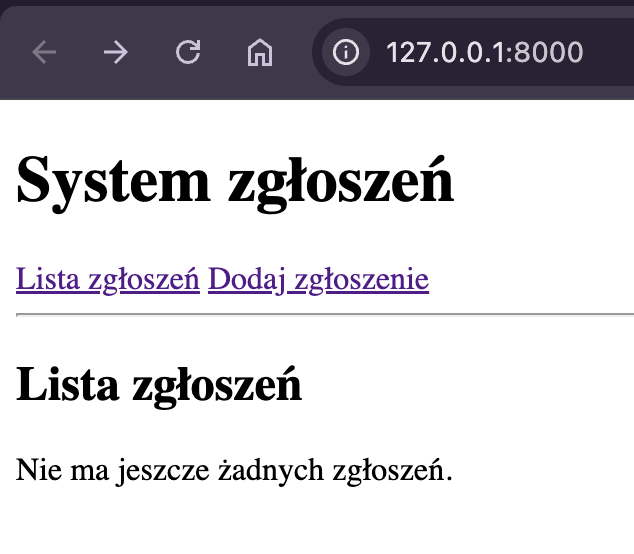

### Krok 13.4 Dodanie szablonu formularza

#### Cel kroku

Przygotować stronę używaną przy dodawaniu i edycji zgłoszeń.

#### Co należy dodać / zmienić

W pliku `zgloszenia/templates/zgloszenia/formularz_zgloszenia.html` wpisz:

```html
 
<h2>{{ tytul }}</h2>

<form method="post">
   {{ form.as_p }}
  <button type="submit">{{ tekst_przycisku }}</button>
</form>

<p>
  <a href="">Wróć do listy</a>
</p>

```

#### Wyjaśnienie

W tym kroku pojawiają się trzy ważne elementy:

1. `{{ tytul }}` i `{{ tekst_przycisku }}` są przekazywane z widoku,
2. `` zabezpiecza formularz wysyłany metodą `POST`,
3. `{{ form.as_p }}` renderuje wszystkie pola formularza jako akapity HTML.

Na tym etapie formularz jest jeszcze prosty, ale już działa. W sekcji o Bootstrapie zastąpimy `form.as_p` bardziej kontrolowanym układem.

#### Sprawdzenie

Wejdź na:

```text
http://127.0.0.1:8000/dodaj/
```

Jeżeli widzisz formularz z polami modelu, szablon działa poprawnie.

> Formularz dodawania zgłoszenia po utworzeniu `formularz_zgloszenia.html`.
>
> 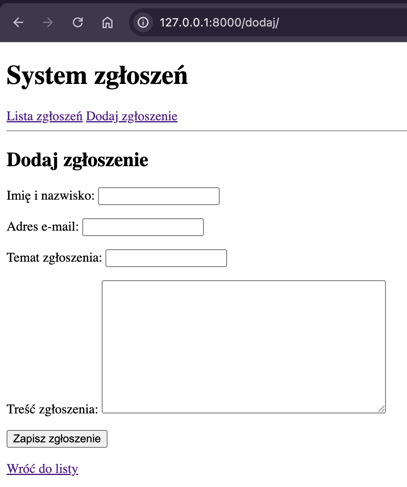

#### Efekt

Można wyświetlić formularz dodawania i edycji zgłoszenia i juz mozna go przetestować.
Wprowadź dane i zapisz:

- Imię i nazwisko: Jan Nowak
- Adres e-mail: jan.nowak@gmail.com
- Temat zgłoszenia: Matematyka Dyskretna
- Treść zgłoszenia: Pomóc z matematyką

Na głównej stronie się pojawi nasze zgłoszenie.

### Krok 13.5 Zamiana prostej listy na tabelę

#### Cel kroku

Pokazać zgłoszenia w czytelniejszej formie niż zwykła lista punktowana.

#### Co należy dodać / zmienić

W pliku `lista_zgloszen.html` zastąp zawartość bloku `content` poniższym fragmentem:

```html

<h2>Lista zgłoszeń</h2>


<table>
  <thead>
    <tr>
      <th>Imię i nazwisko</th>
      <th>Adres e-mail</th>
      <th>Temat</th>
      <th>Data utworzenia</th>
    </tr>
  </thead>
  <tbody>
    
    <tr>
      <td>{{ zgloszenie.imie_nazwisko }}</td>
      <td>{{ zgloszenie.email }}</td>
      <td>{{ zgloszenie.temat }}</td>
      <td>{{ zgloszenie.data_utworzenia|date:"d.m.Y H:i" }}</td>
    </tr>
    
  </tbody>
</table>

<p>Nie ma jeszcze żadnych zgłoszeń.</p>
 

```

#### Wyjaśnienie

Tabela jest lepszym wyborem niż lista, bo każde zgłoszenie ma kilka pól. Dzięki podziałowi na kolumny użytkownik od razu widzi:

1. kto dodał zgłoszenie,
2. jaki jest temat,
3. kiedy rekord został utworzony.

Filtr `date` formatuje datę w czytelnej postaci.

#### Sprawdzenie

Po dodaniu pierwszych rekordów tabela powinna pokazać każdą wartość w osobnej kolumnie.

> 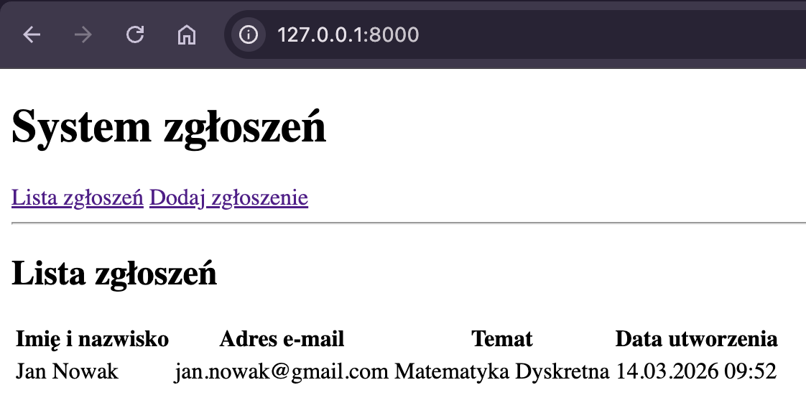

### Krok 13.6 Dodanie linków akcji do tabeli

#### Cel kroku

Umożliwić przejście z listy do edycji i usuwania konkretnego rekordu.

#### Co należy dodać / zmienić

W `lista_zgloszen.html` dodaj kolumnę `Akcje` oraz linki:

```html
<th>Akcje</th>
```

oraz w każdym wierszu:

```html
<td>
  <a href="">Edytuj</a>
  <a href="">Usuń</a>
</td>
```

#### Wyjaśnienie

To właśnie ten krok spina listę z dalszą nawigacją CRUD:

1. kliknięcie `Edytuj` prowadzi do formularza w trybie edycji,
2. kliknięcie `Usuń` prowadzi do strony potwierdzenia.

Zwróć uwagę na `zgloszenie.pk`. Dzięki temu każdy link odnosi się do konkretnego rekordu.

#### Sprawdzenie

Po wyświetleniu tabeli każdy rekord powinien mieć dwa działające odnośniki.

> 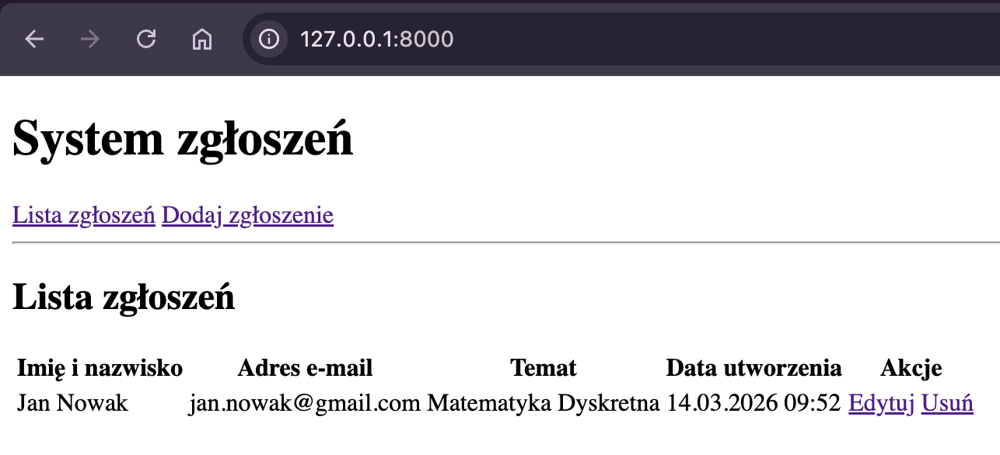

#### Efekt

Lista zgłoszeń pozwala już przejść do kolejnych operacji CRUD.

### Krok 13.7 Dodanie szablonu potwierdzenia usunięcia

#### Cel kroku

Przygotować stronę, która zapyta użytkownika, czy na pewno chce usunąć rekord.

#### Co należy dodać / zmienić

W pliku `zgloszenia/templates/zgloszenia/potwierdz_usuniecie.html` wpisz:

```html
 
<h2>Usuń zgłoszenie</h2>

<p>Czy na pewno usunąć zgłoszenie <strong>{{ zgloszenie.temat }}</strong>?</p>

<form method="post">
  
  <button type="submit">Tak, usuń</button>
</form>

<p>
  <a href="">Nie, wróć do listy</a>
</p>

```

#### Wyjaśnienie

Ten szablon nie usuwa jeszcze danych sam z siebie. Pokazuje jedynie pytanie i formularz potwierdzający operację. Dopiero kliknięcie przycisku wyśle `POST` do widoku `usun_zgloszenie`.

#### Sprawdzenie

Po utworzeniu przynajmniej jednego rekordu wejdź na adres typu:

```text
http://127.0.0.1:8000/usun/1/
```

powinna pojawić się strona z pytaniem o potwierdzenie i usuń rekord.

> 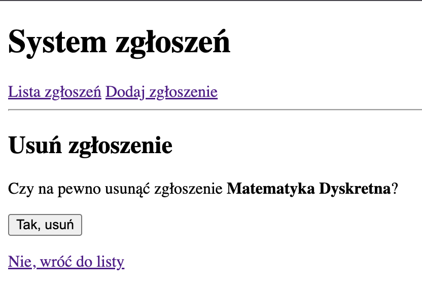

#### Efekt

Usuwanie rekordu ma bezpieczny etap potwierdzenia.

<a id="bootstrap"></a>

## 14. Bootstrap

Do tej pory interfejs był celowo prosty, aby skupić się na działaniu. Teraz poprawimy wygląd krok po kroku. Najpierw dodamy bibliotekę Bootstrap, potem uporządkujemy układ strony, a następnie wystylizujemy formularze, tabelę i przyciski.

### Krok 14.1 Podłączenie Bootstrapa przez CDN

#### Cel kroku

Załadować gotową bibliotekę CSS bez instalowania dodatkowych pakietów.

`https://getbootstrap.com/docs/5.3/getting-started/introduction/`

#### Co należy dodać / zmienić

W pliku `base.html` w sekcji `<head>` dodaj:

```html
<link
  href="https://cdn.jsdelivr.net/npm/bootstrap@5.3.8/dist/css/bootstrap.min.css"
  rel="stylesheet"
/>
```

#### Wyjaśnienie

Bootstrap to gotowa biblioteka stylów. W tym tutorialu wykorzystujemy ją tylko po to, żeby poprawić czytelność interfejsu bez pisania własnego CSS od zera.

#### Sprawdzenie

Po samym dodaniu linku zmiana może być jeszcze mało widoczna. Pełny efekt pojawi się po dodaniu klas do HTML.

#### Efekt

Projekt ma już dostęp do klas Bootstrapa.

### Krok 14.2 Poprawienie układu strony bazowej

#### Cel kroku

Nadać stronie czytelny układ z kontenerem, nagłówkiem i przyciskiem akcji.

#### Co należy dodać / zmienić

W `base.html` zastąp zawartość elementu `<body>` tym fragmentem:

```html
<body class="bg-light">
  <div class="container py-4">
    <div class="d-flex justify-content-between align-items-center mb-4">
      <div>
        <h1 class="h3 mb-1">System zgłoszeń</h1>
        <p class="text-muted mb-0">
          Prosta aplikacja Django do ćwiczenia CRUD.
        </p>
      </div>
      <a href="" class="btn btn-primary"
        >Dodaj zgłoszenie</a
      >
    </div>

    
  </div>
</body>
```

#### Wyjaśnienie

Najważniejsze klasy użyte w tym kroku:

1. `bg-light` ustawia jasne tło,
2. `container` ogranicza szerokość treści i centruje ją,
3. `py-4` dodaje pionowe odstępy,
4. `d-flex justify-content-between` ustawia elementy nagłówka obok siebie,
5. `btn btn-primary` nadaje przyciskowi styl Bootstrapa.

#### Sprawdzenie

Po odświeżeniu strony nagłówek powinien wyglądać znacznie czytelniej niż wcześniej.

> Widok strony po dodaniu Bootstrapa do `base.html`.
>
> 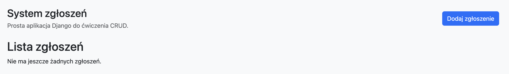

#### Efekt

Cała aplikacja korzysta już z bardziej uporządkowanego układu.

### Krok 14.3 Dodanie klas Bootstrapa do formularza w `forms.py`

#### Cel kroku

Sprawić, aby pola formularza były automatycznie renderowane z klasami CSS Bootstrapa.

#### Co należy dodać / zmienić

W klasie `Meta` formularza `ZgloszenieForm` (`zglosznia/forms.py`) dopisz:

```python
        widgets = {
            "imie_nazwisko": forms.TextInput(attrs={"class": "form-control"}),
            "email": forms.EmailInput(attrs={"class": "form-control"}),
            "temat": forms.TextInput(attrs={"class": "form-control"}),
            "tresc": forms.Textarea(attrs={"class": "form-control", "rows": 5}),
        }
```

#### Wyjaśnienie

`widgets` pozwalają kontrolować sposób generowania pól HTML. Dzięki `class="form-control"` każde pole otrzyma styl zgodny z Bootstrapem.

Pole `tresc` korzysta z `Textarea`, bo ma być większym polem wielowierszowym.

#### Sprawdzenie

Po wejściu na formularz pola powinny mieć styl Bootstrapa, ale dopiero następny krok da nam większą kontrolę nad rozmieszczeniem etykiet i komunikatów błędów.

> 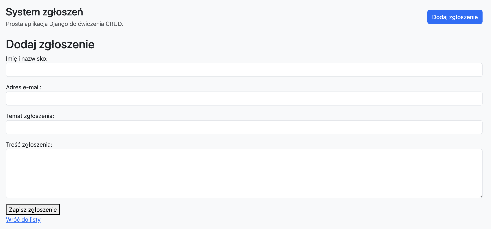

#### Efekt

Formularz ma już przygotowane klasy CSS na poziomie Pythona.

### Krok 14.4 Wystylizowanie listy zgłoszeń

#### Cel kroku

Nadać tabeli, pustemu komunikatowi i linkom akcji czytelniejszy wygląd.

#### Co należy dodać / zmienić

W `lista_zgloszen.html` zamień blok `content` na:

```html

<div class="card shadow-sm">
  <div class="card-body">
    <h2 class="h5 mb-3">Lista zgłoszeń</h2>

    
    <div class="table-responsive">
      <table class="table table-striped align-middle">
        <thead>
          <tr>
            <th>Imię i nazwisko</th>
            <th>Adres e-mail</th>
            <th>Temat</th>
            <th>Data utworzenia</th>
            <th>Akcje</th>
          </tr>
        </thead>
        <tbody>
          
          <tr>
            <td>{{ zgloszenie.imie_nazwisko }}</td>
            <td>{{ zgloszenie.email }}</td>
            <td>{{ zgloszenie.temat }}</td>
            <td>{{ zgloszenie.data_utworzenia|date:"d.m.Y H:i" }}</td>
            <td>
              <a
                href=""
                class="btn btn-sm btn-warning"
                >Edytuj</a
              >
              <a
                href=""
                class="btn btn-sm btn-danger"
                >Usuń</a
              >
            </td>
          </tr>
          
        </tbody>
      </table>
    </div>
    
    <div class="alert alert-info mb-0">
      Nie ma jeszcze żadnych zgłoszeń. Należy dodać pierwszy rekord.
    </div>
    
  </div>
</div>

```

#### Wyjaśnienie

Ten krok wprowadza kilka przydatnych klas:

1. `card` i `card-body` tworzą estetyczny blok treści,
2. `table table-striped` poprawiają czytelność tabeli,
3. `table-responsive` poprawia zachowanie tabeli na węższych ekranach,
4. `btn btn-sm ...` zamienia zwykłe linki w wyraźne przyciski,
5. `alert alert-info` czytelnie pokazuje pusty stan listy.

#### Sprawdzenie

Ponownie stwórz zgłoszenie i zapisz:

- Imię i nazwisko: Jan Nowak
- Adres e-mail: jan.nowak@gmail.com
- Temat zgłoszenia: Matematyka Dyskretna
- Treść zgłoszenia: Pomóc z matematyką
  Po odświeżeniu strony tabela i przyciski powinny wyglądać wyraźnie lepiej niż wcześniej.

> Lista zgłoszeń po stylizacji tabeli i przycisków.
>
> 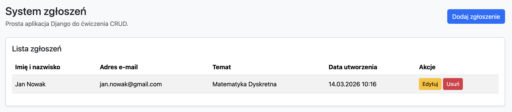

#### Efekt

Strona listy jest czytelna zarówno dla pustej bazy, jak i dla istniejących rekordów.

### Krok 14.5 Wystylizowanie formularza dodawania i edycji

#### Cel kroku

Zastąpić surowe `form.as_p` bardziej kontrolowanym układem formularza.

#### Co należy dodać / zmienić

W `formularz_zgloszenia.html` ustaw:

```html
 
<div class="card shadow-sm">
  <div class="card-body">
    <h2 class="h5 mb-3">{{ tytul }}</h2>

    <form method="post">
       
      <div class="mb-3">
        <label for="{{ field.id_for_label }}" class="form-label"
          >{{ field.label }}</label
        >
        {{ field }} 
        <div class="text-danger small mt-1">{{ field.errors }}</div>
        
      </div>
      

      <button type="submit" class="btn btn-primary">
        {{ tekst_przycisku }}
      </button>
      <a href="" class="btn btn-secondary"
        >Anuluj</a
      >
    </form>
  </div>
</div>

```

#### Wyjaśnienie

Teraz formularz jest renderowany pole po polu, co daje większą kontrolę nad:

1. etykietami,
2. błędami walidacji,
3. odstępami między polami,
4. wyglądem przycisków.

Klasa `form-label` stylizuje etykiety, a `mb-3` dodaje odstępy między polami.

#### Sprawdzenie

Po wejściu na stronę dodawania formularz powinien być czytelny, a po podaniu niepoprawnych danych błędy powinny pojawić się pod odpowiednimi polami.

> Formularz zgłoszenia po stylizacji Bootstrapem.
>
> 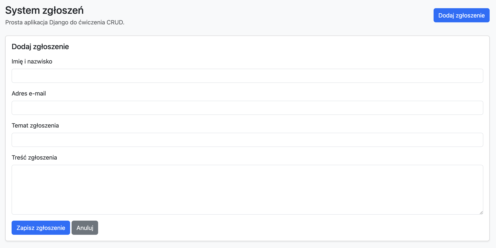

#### Efekt

Formularz jest gotowy do wygodnej pracy użytkownika.

### Krok 14.6 Wystylizowanie ekranu usuwania

#### Cel kroku

Nadać stronie potwierdzenia usunięcia spójny wygląd z resztą aplikacji.

#### Co należy dodać / zmienić

W `potwierdz_usuniecie.html` ustaw:

```html
 
<div class="card shadow-sm">
  <div class="card-body">
    <h2 class="h5 mb-3">Usuń zgłoszenie</h2>
    <p>
      Czy na pewno usunąć zgłoszenie <strong>{{ zgloszenie.temat }}</strong>?
    </p>

    <form method="post">
      
      <button type="submit" class="btn btn-danger">Tak, usuń</button>
      <a href="" class="btn btn-secondary"
        >Nie, wróć</a
      >
    </form>
  </div>
</div>

```

#### Wyjaśnienie

To ten sam schemat wizualny co w innych widokach:

1. `card` porządkuje treść,
2. `btn-danger` podkreśla, że operacja jest nieodwracalna,
3. `btn-secondary` daje bezpieczny powrót do listy.

#### Sprawdzenie

Po wejściu na stronę usuwania ekran potwierdzenia powinien być czytelny i spójny z resztą interfejsu.

> 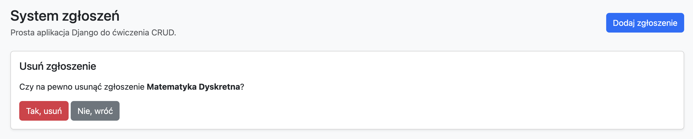

#### Efekt

Wszystkie widoki użytkownika mają jednolity wygląd.

<a id="crud"></a>

## 15. CRUD

### Pełna mapa CRUD w projekcie

| Operacja | URL                | Widok               | Szablon                     | Rezultat             |
| -------- | ------------------ | ------------------- | --------------------------- | -------------------- |
| Create   | `dodaj/`           | `dodaj_zgloszenie`  | `formularz_zgloszenia.html` | zapis nowego rekordu |
| Read     | `""`               | `lista_zgloszen`    | `lista_zgloszen.html`       | wyświetlenie listy   |
| Update   | `edytuj/<int:pk>/` | `edytuj_zgloszenie` | `formularz_zgloszenia.html` | aktualizacja rekordu |
| Delete   | `usun/<int:pk>/`   | `usun_zgloszenie`   | `potwierdz_usuniecie.html`  | usunięcie rekordu    |

<a id="podsumowanie"></a>

## 16. Podsumowanie

W ramach tutoriala zostały wykonane wszystkie podstawowe kroki potrzebne do zbudowania prostej aplikacji Django:

1. utworzono projekt i aplikację,
2. zdefiniowano model danych,
3. wykonano migracje,
4. uruchomiono panel administratora,
5. przygotowano formularz,
6. napisano widoki,
7. skonfigurowano URL-e,
8. przygotowano szablony HTML,
9. poprawiono wygląd z użyciem Bootstrapa,
10. sprawdzono pełny CRUD.
